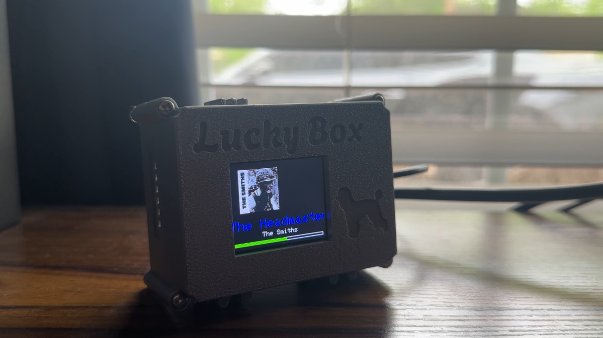
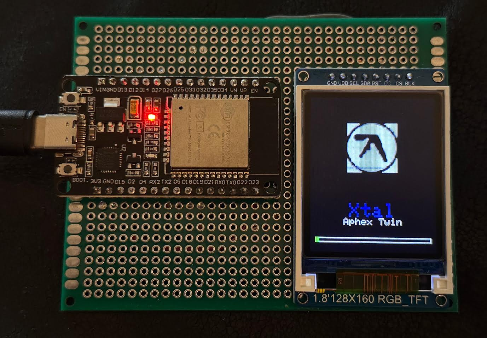

# esp32 spotify now playing display

this project runs on an esp32 and displays the currently playing  
spotify song on a 1.8" tft screen. it shows the album art, song  
title (with scrolling), and a progress bar. there are also buttons  
for skipping tracks and play/pause if you want to hook them up.

// ------- project structure ------- //

design process video: https://www.youtube.com/watch?v=UWNBKuJdgTA

/spotify_now_playing.ino      → main sketch  
/secrets_template.h           → template for inserting your spotify + wifi credentials  
/secrets.h                    → (you create this locally — should not be uploaded)  
/README.md                    → you're reading it now :)

CAD files
- [Download the case (ZIP)](./models.zip)

/lower_case.stl      → lower half of case  
/upper_case.stl      → upper half of case  
/tft_rear.stl        → TFT rear casing  

# getting started

// ------- what you need ------- //  
(most components are available on amazon)

- esp32 dev board  
- 1.8" spi tft lcd (st7735)  
- stable wi-fi connection  
- push buttons (optional)  
- usb cable
- 4x M3 brass heat inserts
- 4x M3x25mm screws
- PLA roll (for 3d printing)

// ------- 3d printed case ------- //  
download and print the 3 case files in /3d_models

// ------- wiring (my setup) ------- //  
(you can change the pins in the code if you're using different ones)

| tft pin | esp32 gpio |
|---------|------------|
| cs      | 13         |
| dc      | 12         |
| rst     | 14         |
| scl     | 18         |
| sda     | 19         |
| gnd     | gnd        |
| vcc     | 3.3v       |

// ------- libraries needed ------- //  
install these libraries in the arduino ide:
bb
- adafruit gfx  
- adafruit st7735 and st7789  
- arduinojson  
- wifi  
- httpclient  
- spi  
- fs (spiffs)

// ------- setting up your own "secrets.h" ------- //
1. copy the contents of "secrets_template.h" into a new file called "secrets.h"  
2. fill in your wifi and spotify information

make sure secrets.h is never uploaded — it should always remain in .gitignore

spotify auth setup
// ------- getting a spotify refresh token ------- //
to display your "now playing" song, you need a spotify refresh token.
this gives your esp32 permission to access your playback info.

steps:
go to https://developer.spotify.com/dashboard
log in and create a new app
add this redirect uri: http://localhost:8888/callback
copy your client id and client secret into secrets.h

generate a refresh token using:
https://github.com/eeveelution/spotify-refresh-token-generator
(or search for "spotify refresh token generator" on github)

this tool will:
ask you to log in to your spotify account
let you pick scopes like user-read-playback-state
give you a refresh_token you can paste into secrets.h

// ------- note: access tokens (client_credentials) ------- //
the curl command below uses the client credentials flow,
which is only useful for public data. it won’t work with now playing.

get a basic access token (for testing only):

curl -X POST https://accounts.spotify.com/api/token \
  -H "Content-Type: application/x-www-form-urlencoded" \
  -d "grant_type=client_credentials" \
  -d "client_id=your_client_id" \
  -d "client_secret=your_client_secret"
but again — this does not give access to your playback info.
you still need a refresh token for the actual display to work.

--------- extras ---------

// ------- optional button controls ------- //
If you wire buttons, you can control playback:

| action	    |   gpio pin |
|-------------|------------|
| play/pause	|      26    |
| next track	|      25    |

you can change these in the code under the button pin definitions.

// ------- troubleshooting ------- //
nothing shows up on screen
-- double check your wiring and gpio pin numbers

serial monitor says "unauthorized"
-- your refresh token might be expired or incorrect

display freezes mid-song
-- try increasing delay between spotify api calls to avoid rate limits

// ------- to-do / future ideas ------- //
add volume control via rotary encoder
auto-dim screen for saving power
improve scrolling text effect
cache album art to reduce api calls

// ------- preview ------- //

// ------- license ------- //
this project is licensed under the MIT license.  
see the LICENSE file for more info.

